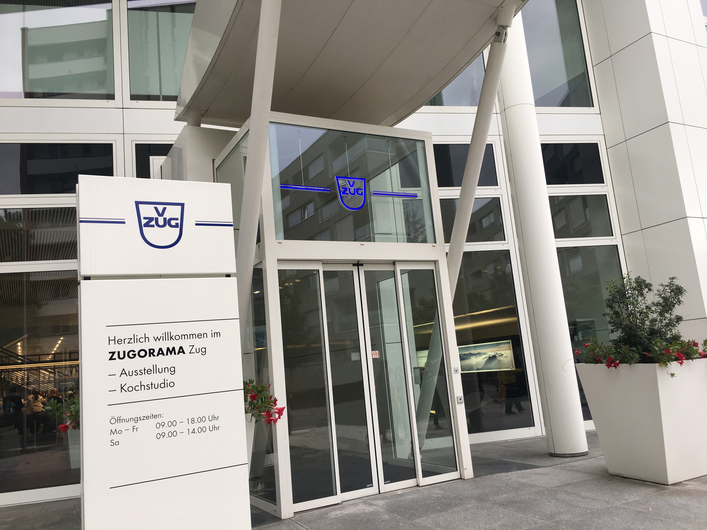
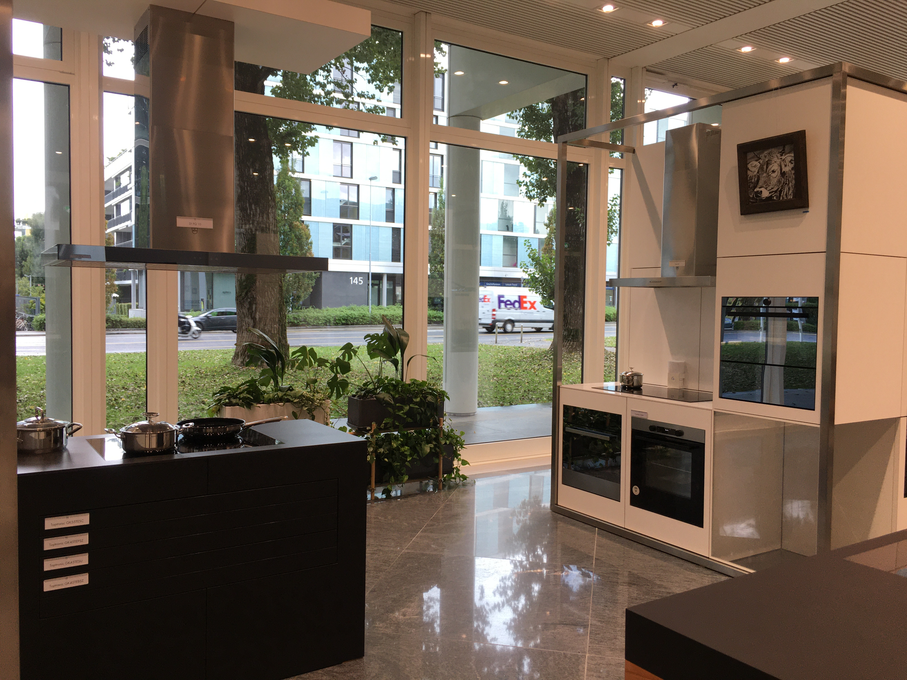
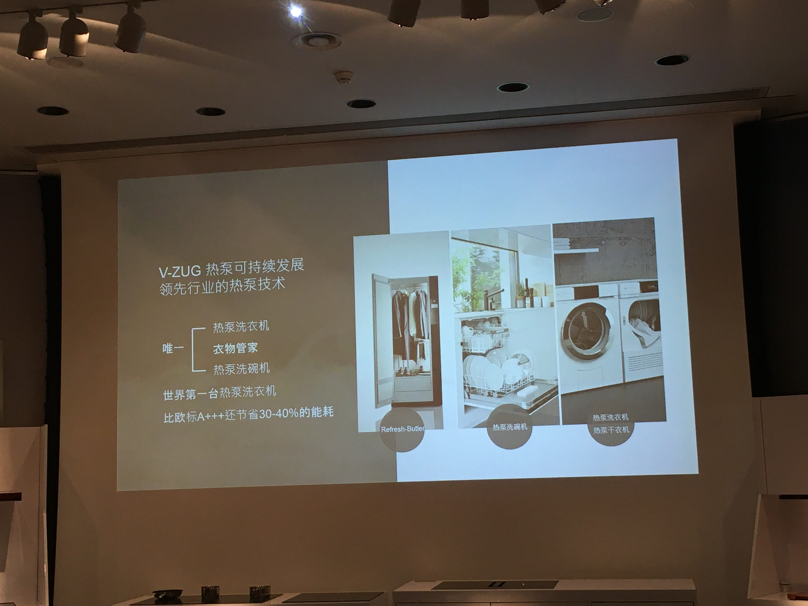
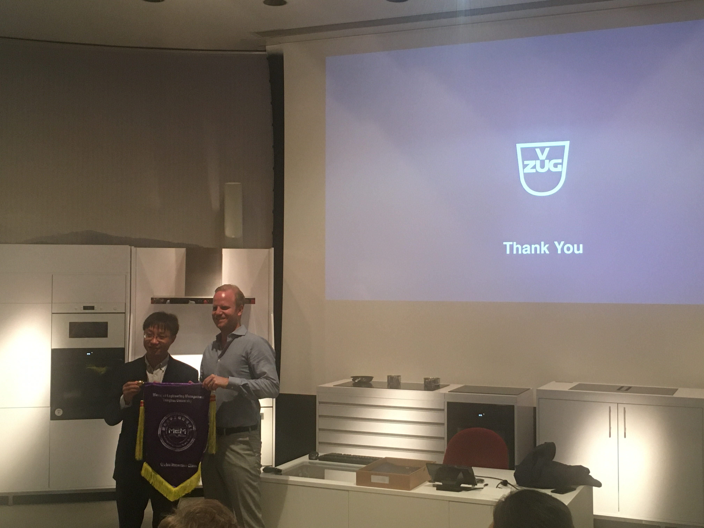

###### [返回大纲](../xinwengao.md)

-------------------------------------------------------------------------------

# [V-ZUG](https://www.vzug.com/cn/zh/home)企业参访

> 10月4日下午，我们参访了具有百年历史的瑞士高端品牌厨房用品生产商V-ZUG(瑞族)。
> V-ZUG是瑞士家居电器的领头企业，乃瑞士精工的代名词。100多年以来，V-ZUG始终秉
> 承着具有浓厚瑞士特色的价值观 -- "简单的个性化解决方案，让人终生受益"，一直
> 致力于生产高品质的创新型家用电器，以提高人们的生活质量。其主要产品包括:
> 蒸炉、烤箱、微波炉、咖啡台、抽油烟机、灶具、洗碗机、冰箱、酒柜、洗衣机等。 
>

|     |
|:---:|
||
|**V-ZUG公司总部**|

> V-ZUG的产品最大特点就是**品质优越**、**性能稳健**和**持久耐用**。
> 每一台V-ZUG家电都采用了优质材料、现代化的制造方法，由专业娴熟的工人制造完成，品质绝对优越，性能绝对可靠。
>

|     |
|:---:|
||
|**V-ZUG公司家电展厅一角**|

> 在参访的过程中，我们了解到V-ZUG，无论是在烹饪、洗碗还是在洗衣家电领域，都拥有多项“世界首创”技术并申请了专利保护。
> 正是因为拥有了这些创新技术，V-ZUG才确保了其产品具有极高的精准性。
> 同时，V-ZUG是名副其实的兼具环保、美学、质量与效能的世界级品牌，
> 在环保主题上一直具有远见卓识，其旗下的每一个产品都有卓越的节能成效，超越欧洲能源普通标准，比欧标最高节能标准最高甚至高出50%以上。
> V-ZUG具有行业领先的热泵技术，世界第一台热泵洗衣机正是V-ZUG的作品，比欧标A+++还节省30-40%的能耗。
> 

|     |
|:---:|
||
|**V-ZUG热泵技术介绍**|

> 作为顶级的高端家电生产商，V-ZUG对自己的产品定位非常明确，那就是只作高端家电产品，不会因为过多的商业利益追求去做物美价廉的中低端产品。
> 这是由V-ZUG公司的基因所决定的，更是与其极强的社会责任感密不可分的，很值得中国的企业家们借鉴和学习。
> 参访结束后，本次移动课堂的指导老师马靓教授向V-ZUG的负责人赠送了清华大学MEM锦旗。

|     |
|:---:|
||
|**马靓教授向V-ZUG的负责人赠送清华大学MEM锦旗**|

-------------------------------------------------------------------------------
###### [参考文案](http://mem.ie.tsinghua.edu.cn/Show/index/cid/9/id/1570.html)
-------------------------------------------------------------------------------
###### [返回大纲](../xinwengao.md)
